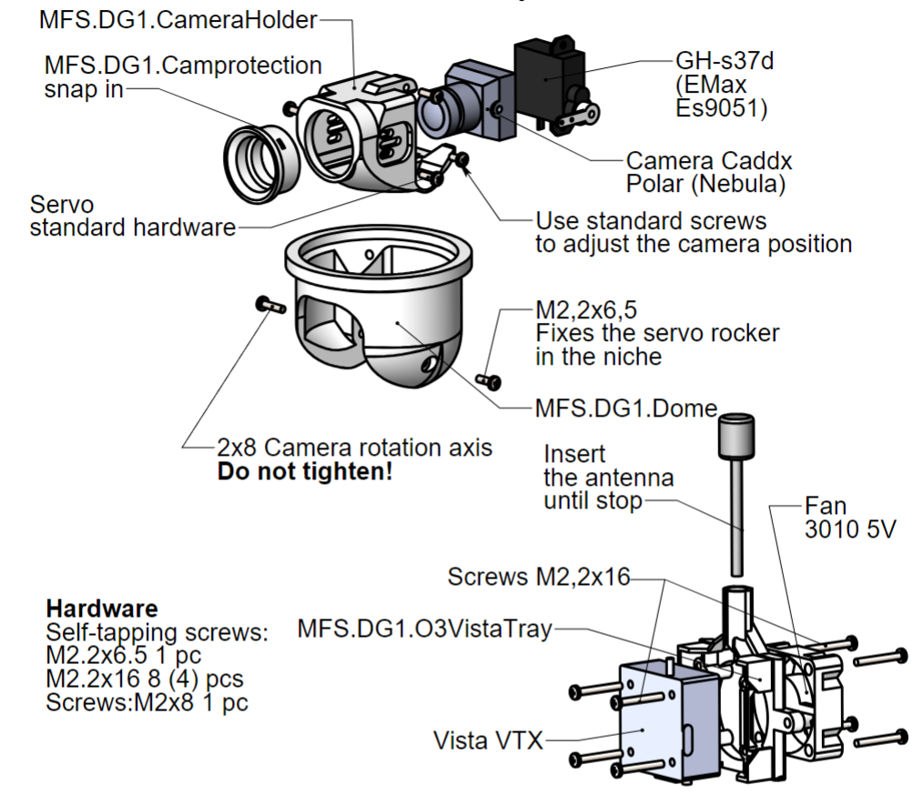

---
#文章标题
title: "AdeleX-10"

#文章创建日期
date: 2024-11-15 13:00:00

#文章更新日期
updated: 

#文章标签
tags: 
    - Others

#文章分类
categories: 
    - 

#文章关键字
keywords: 

#文章描述stick
description: 
    - 

#文章顶部图片
top_img: "/img/49170889_p0.webp"

#文章缩略图(如果没有设置top_img,文章页顶部将显示缩略图，可设为false/图片地址/留空)
cover: ""

#置顶权重
sticky: 0    

#显示文章评论模块(默认 true)
comments: false

#文章版权模块的文章作者
copyright_author: "MisakaAE"

#文章版权模块的文章作者链接
copyright_author_href: 

#文章版权模块的文章连结链接
copyright_url: 

#文章版权模块的版权声明文字
copyright_info: "本文著作权归作者所有。商业转载请联系作者获得授权，非商业用途请标明出处。"

#配置代码框是否展开(true/false)(默认为设置中 highlight_shrink 的配置)
highlight_shrink: false

#显示侧边栏 (默认 true)
aside: true
---

# VTOL AdeleX-10 小型 FPV 无人机

+ 组装与操作手册

## 信息

+ AdeleX-10 是一种通用的垂直起降 FPV 飞机模型。其主要载荷是一个用于任何 19x19mm FPV 相机的双轴旋转伺服云台。推荐的视频系统：大疆 FPV 搭配 Polar/Nebula Pro/O3 相机，Walksnail Avatar。

+ VTOL 飞机的主要优点是结合了四旋翼和飞机的优点。该飞机能够在未经准备和有限尺寸的平台上垂直起降，同时在水平飞行中快速飞行。在飞机模式下，AdeleX-10 的能耗约为悬停时的三分之一。

### 主要特性：
+ 空重（不含电池）：850 g
+ 正常起飞重量：1300 g
+ 翼展：1000 mm
+ 翼面积：12.5 平方分米
+ 翼载荷：114 g/平方分米
+ 巡航速度：70 km/h
+ 失速速度：50 km/h
+ 最高速度：150 km/h
+ 最大风速
+ 起飞时地面：7 m/s
+ NVM 功率：
+ 悬停：370 W
+ 巡航模式：130 W
+ 巡航范围，
+ 在 4500 mAh（6S）消耗下：35-40 km
+ 飞机模式的最高高度，
+ 不低于：2000 m
+ 工作温度范围：-15 +35 摄氏度
+ 飞行控制器软件：Ardupilot，INAV

**该飞机适应主要航空公司的手提行李尺寸。**

### 推荐电子设备：
+ 飞机：
1. `推力电机（1 个）`：电机 EMax 2807 1300kv，ESC 6s 30A，螺旋桨 Gemfan 7042。
2. `升力电机（4 个）`：电机 2004 EMax 1600 kv，螺旋桨 Gemfan 5126-2。

3. `ESC` 4合1 6S，每通道不低于 30A，
4. `伺服器`：GH-S37D（EMax Es9051）4 个。
5. `电池`：Li-Ion 6s1p 21700，电流输出至少 30A。
6. `飞行控制器`：Matek H743，SpeedyBee F405 wing。
7. `气速传感器`：Matek ASPD-4525。

 

+ **云台**：
`俯仰伺服器`：GH-S37D（EMax Es9051）- 1 个。
8. 旋转伺服器：DM-s0090d（270 度）- 1 个。\
9. FPV 视频系统：大疆，Walksnail Avatar。
10. 遥控系统：TBS Crossfire，ELRS。
11. 冷却风扇：5V 3010

## 组装建议

### 安全措施：
1. 在通风良好的区域使用胶水和激活剂。

2. 不要将零件或组装好的飞机长时间放在阳光直射下或温度超过 40 度的房间中，需注意降温。

3. 连接电源和各种设备时，请注意极性。

4. 在地面检查电机时，一定要拆下螺旋桨，以避免严重受伤。

### 组装过程中：
1. 在连接之前，尽量“干接”零件。如果有毛刺和不规则，使用锋利的刀具修整。

2. 为了方便推入轴，建议使用少量硅脂。

3. 在组装悬挂系统时，请小心并保持注意：伺服器上的摇臂必须安装在极限位置时不会损坏齿轮箱。所有云台和副翼控制通道必须设置为中立（1500 μs）。使用自动驾驶仪配置器准确设置云台的中立位置。

### 组装所需材料和配件：
1. FDM 材料：ABS 高科技塑料/PLA+ Esun 
2. 胶水：该模型无需胶水组装
3. 电线：16、24 和 28 AWG
4. 连接器：XT60 1 个，XT30 1 个（可选）
5. 伺服延长线：200 mm 6 个
6. 碳纤维：方形剖面 6x6x500 mm 3 个
7. 推杆：钢丝 1.2 mm 或现成的杆 L=200mm
8. 杆的塑料端头 1.2 mm 4 个
9. 电池带 250 mm 1 个
10. 尼龙扎带 2 mm
11. 五金：
    黄铜支架 M2x12 4 个（仅适用于 SpeedyBee F405 Wing FC）
    **圆头自攻螺丝 DIN 7981：**
    2.2x4.5- 2 个
    2.2x6.5- 5 个。
    2.2x9.5- 38 个
    2.2x16- 16 个
    **螺钉 DIN 7045：**
    M2x8 - 29 个
    M2x16 - 16 个
    **六角螺栓 DIN 933：**
    M3x16 3 个
    M5x25 1 个
    **锁紧螺母 DIN 985：**
    M3 - 3 个
    M5 - 1 个

## 打印选项

为了获得最佳效果，我们强烈建议遵循说明。该模型设计用于 220x220x200 mm 的打印区域。

从结构上讲，模型零件分为两种类型，每种类型需要配置打印配置文件：

1. 由薄壁 ABS（PLA+，PETG）制成的零件，机身、稳定器和翼。配置文件 T（薄壁）。
2. 由 ABS（PLA+，PETG）制成的密实零件，带填充。这些是动力元件：电机座、支架、悬挂。配置文件 S（实心）。
    

每台打印机都是独特的，可能需要更精确的参数选择以获得最佳打印质量。

如果桌面附着力差，建议使用打印胶水或添加边框。

ABS 应该在高喷嘴温度（超过 275 度）和良好加热的腔体（桌面 100 度）下打印。打印桥时应开启气流。对于一般外轮廓，气流应设置为层有时间硬化，但在铺设新层之前不会冷却。

HTP（高科技塑料）的 ABS-6 表现出色。

对于 PLA+，温度分别为 240 和 60 度，不需要加热室。建议不使用 ESUN 以外其他公司的塑料。

### 注意：
1. 一定要在打印前干燥塑料！ 
2. 用 ABS 制成的零件可以用 PLA+ 或 PETG 制成的零件替换，但电机和视频发射器的托盘除外。它们只能用 ABS 或 PETG 打印，以避免因过热而变形。

## 打印零件列表

*标记为“镜像”的零件将在切片软件中根据数量反射。*
*所有零件的总重量约为 370 克。*

## 零件在打印机床上的位置

*零件位置和方向的示例。*
*支撑必须关闭。*

*零件位置和方向的示例。*
***支撑仅适用于 AAX10.003 部件。稳定器，单件变体***
*要消除上方不必要结构的生成，请启用“支撑阻挡器”修饰器*

*零件位置和方向的示例。*
*支撑应关闭。*
***稳定器的两部分打印版本***

*零件位置和方向的示例。*
*支撑必须关闭。*

## 模型的整体视图

**基本组装单元**
在文件压缩包中位于
单独的文件夹中

## 稳定器
您可以将稳定器作为一个整体打印，但需要添加支撑。

...或者由两部分组成，通过螺丝连接，但不需要支撑。

## 翼

## 主舱口

## 推力电机螺旋桨和飞控堆

## 舵机云台
+ 大疆视觉模块

+ 大疆 O3 图传

+ 在组装云台时，请将伺服器放置在与云台的工作行程相对应的位置。所有云台控制通道在调试之前必须处于中立位置（1500 μs）。这样做是为了在首次开启时不损坏伺服驱动齿轮箱。
+ 平相机位置 0 度对应于 ~2000 μs
    垂直位置 ~1000 μs
+ 对于水平旋转伺服器，建议将 PWM 范围设置为 800-2200 μs

