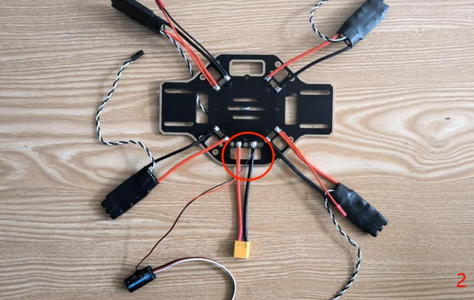
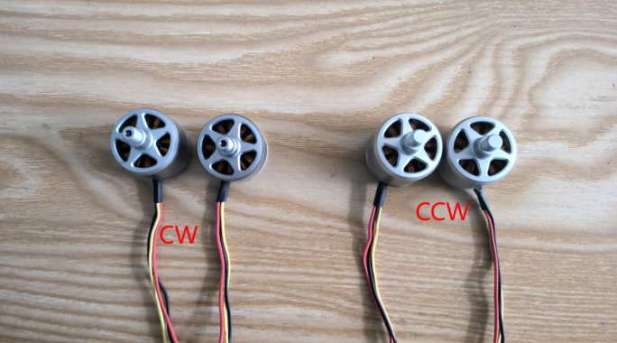
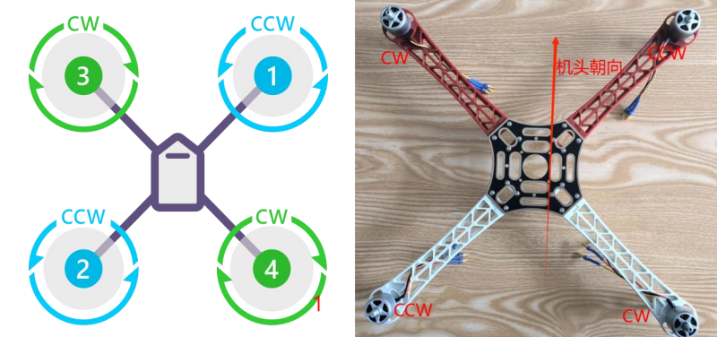
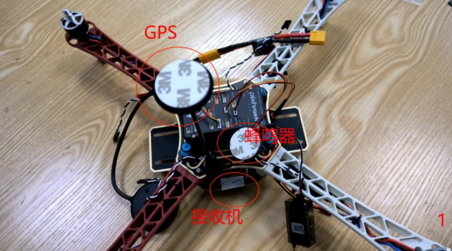

---
#文章标题
title: "无人机WIki"

#文章创建日期
date: 2024-11-08 18:00:00

#文章更新日期
updated: 

#文章标签
tags: 
    - Others

#文章分类
categories: 
    - 

#文章关键字
keywords: 

#文章描述stick
description: 
    - 

#文章顶部图片
top_img: "/img/49170889_p0.webp"

#文章缩略图(如果没有设置top_img,文章页顶部将显示缩略图，可设为false/图片地址/留空)
cover: ""

#置顶权重
sticky: 0    

#显示文章评论模块(默认 true)
comments: false

#文章版权模块的文章作者
copyright_author: "MisakaAE"

#文章版权模块的文章作者链接
copyright_author_href: 

#文章版权模块的文章连结链接
copyright_url: 

#文章版权模块的版权声明文字
copyright_info: "本文著作权归作者所有。商业转载请联系作者获得授权，非商业用途请标明出处。"

#配置代码框是否展开(true/false)(默认为设置中 highlight_shrink 的配置)
highlight_shrink: false

#显示侧边栏 (默认 true)
aside: true
---

+ 无人机知识库


# F450 组装教程操作


警告
1.本飞行器不是玩具，使用前请仔细阅读本操作指南并严格按照规定操作，错误的安装和使用可能导致财产损失甚至威胁人身安全！
2.本飞行器属于航模，仅用于学习、测试、研发、实验控制及周边使用，对于在使用中造成违反公共秩序或公共安全的行为，用户必须承担相应的责任！
3.在未熟悉飞行器操控之前，请勿在人群聚集地、闹市区、高压线、信号塔等地方飞行，避免发生意外！
4.请不要在国家明令禁止飞行的地方飞行，如机场、航空管制区、军事设施敏，感区等！
5.请勿单独交与未成年人使用！
6.开源无人机使用入门有一定难度！航模爱好者应有一定耐心，本着新手好问勤练习，远离人群勿炫耀的原则，只有在多次练习和学习以后，才能逐渐掌握飞行技巧！


### 一．组装配件图

### 二．机架组装
1. 分电板焊接
+ 需要准备分电板.电调.JST 接头.XT60 接头.（数量为图中数量）如图所示:
    

+ 焊接后
    

+ 富斯回传模块焊接（将针头剪掉与 XT60 接头焊接再一起）：
    
    

2. 机臂电机安装
    需要准备勾机臂.电机.M3x9.如图所示：
    

+ 安装时需要区分一下电机型号 CW 与 CCW，安装时两种不同颜色的机臂分别安装一种型号的电机。
    如图所示：
    
    

3. 机架安装
+ 需要准备组装好的机臂.焊接好的分电板.上顶板.M2x8 螺丝.
    

+ 首先安装机臂与上顶板（机臂位置与图1 对照）
    

+ 再安装分电板
    
    

+ 机架安装图 1 与电调安装接线图 2
    

+ 电调接线顺序可以与图 2 中一致。再将电调困扎并粘贴富斯回传模块
    

4. 配件安装
+ 需要准备减震球，减震板，飞控，机架。
    

+ 先安装减震板：
    

+ 再进行组装：
    

+ GPS 支架安装（将图 1 标注螺丝拆下安装）：
    

5. 配件安装并进行接线连接
+ 需要准备机架，配件包，GPS，电流计，接收机。
    

+ 电流计（与 xt60 接头连接并将 6 针接头接在飞控POWER 串口）：
    

+ 配件包（蜂鸣器接在飞控 BUZZER,安全开关接在SWITCH）:
    

+ GPS（6 针接头接在飞控 GPS 串口，4 针接在12C 串口）：
    

+ 接收机（配件包里 3PIN 接头用于飞控与接收连接再RCIN接口）：
    
    

+ 将所有物件粘贴与困扎：
    
    
    
    
    

+ 电调接线：
    > 电调我们以图 1 电机顺序为例，图 1 中的 1234 号电机按照顺序接在飞控的MAINOUT 的 1234 接口并按照 1234 的接线顺序接线，黑色线在上。
    

+ 将剩余长线困扎：
    

6. 脚架的安装
    需要准备分安装好的机架，脚架，M2x10 螺丝。
    
    

+ Done
    

# F450 调试内容

## 资料下载
>  


地面站软件是 Pixhawk 无人机组装调试最重要的工具
注意：电脑最好是使用 Win10 系统，Win10 以前的系统可能由于缺少必要的插件会导致启动失败


> 


固件可以理解为刷写到飞控的控制程序
注意：无人机发货前已经组装调试好，不需要再下载固件，此固件可留着备用。


> 


地面站无法识别 COM 口通过安装 Arduino IDE 的方法来安装驱动；
Arduino IDE 安装完成后，再连接飞控查看是否能够正常使用


