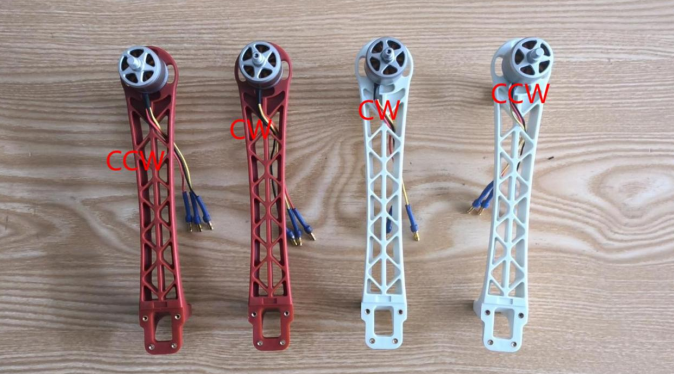
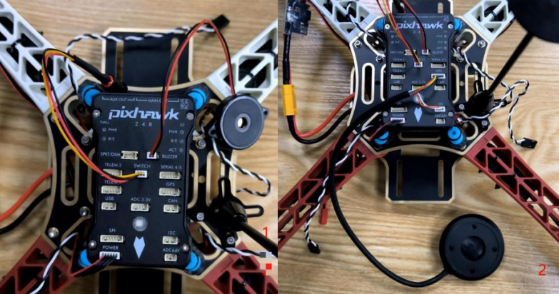
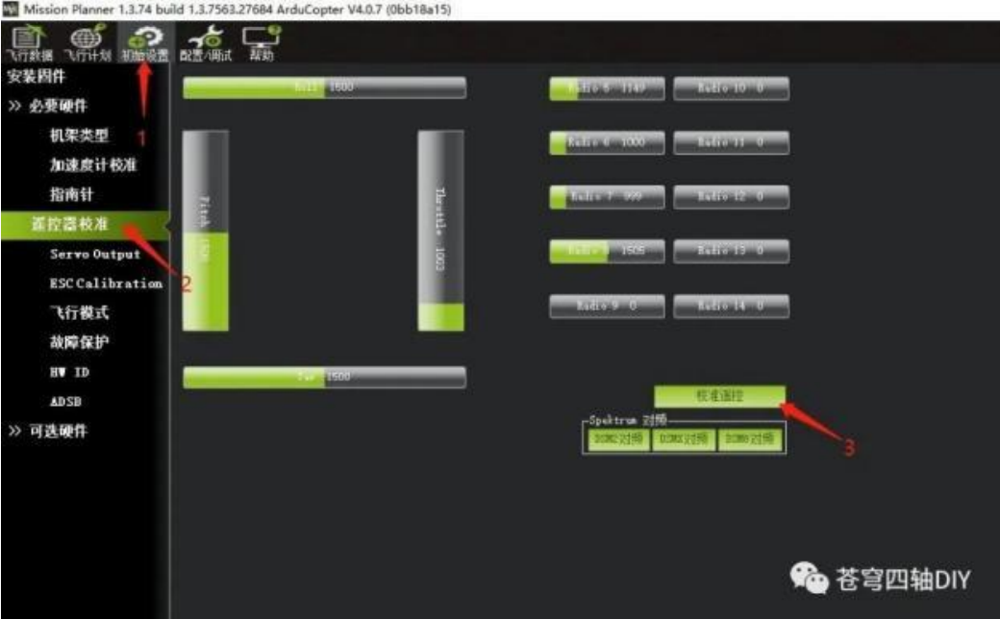

---
#文章标题
title: "F450 组装及调试"

#文章创建日期
date: 2024-11-08 18:00:00

#文章更新日期
updated: 

#文章标签
tags: 
    - Others

#文章分类
categories: 
    - 

#文章关键字
keywords: 

#文章描述stick
description: 
    - 

#文章顶部图片
top_img: "/img/49170889_p0.webp"

#文章缩略图(如果没有设置top_img,文章页顶部将显示缩略图，可设为false/图片地址/留空)
cover: ""

#置顶权重
sticky: 0    

#显示文章评论模块(默认 true)
comments: false

#文章版权模块的文章作者
copyright_author: "MisakaAE"

#文章版权模块的文章作者链接
copyright_author_href: 

#文章版权模块的文章连结链接
copyright_url: 

#文章版权模块的版权声明文字
copyright_info: "本文著作权归作者所有。商业转载请联系作者获得授权，非商业用途请标明出处。"

#配置代码框是否展开(true/false)(默认为设置中 highlight_shrink 的配置)
highlight_shrink: false

#显示侧边栏 (默认 true)
aside: true
---

+ 无人机知识库



# F450 组装教程操作


警告
1.本飞行器不是玩具，使用前请仔细阅读本操作指南并严格按照规定操作，错误的安装和使用可能导致财产损失甚至威胁人身安全！
2.本飞行器属于航模，仅用于学习、测试、研发、实验控制及周边使用，对于在使用中造成违反公共秩序或公共安全的行为，用户必须承担相应的责任！
3.在未熟悉飞行器操控之前，请勿在人群聚集地、闹市区、高压线、信号塔等地方飞行，避免发生意外！
4.请不要在国家明令禁止飞行的地方飞行，如机场、航空管制区、军事设施敏，感区等！
5.请勿单独交与未成年人使用！
6.开源无人机使用入门有一定难度！航模爱好者应有一定耐心，本着新手好问勤练习，远离人群勿炫耀的原则，只有在多次练习和学习以后，才能逐渐掌握飞行技巧！


### 一．组装配件图


### 二．机架组装
1. 分电板焊接
+ 需要准备分电板.电调.JST 接头.XT60 接头.（数量为图中数量）如图所示:
    

+ 焊接后
    

+ 富斯回传模块焊接（将针头剪掉与 XT60 接头焊接再一起）：
    
    

2. 机臂电机安装
    需要准备勾机臂.电机.M3x9.如图所示：
    

+ 安装时需要区分一下电机型号 CW 与 CCW，安装时两种不同颜色的机臂分别安装一种型号的电机。
    如图所示：
    
    

3. 机架安装
+ 需要准备组装好的机臂.焊接好的分电板.上顶板.M2x8 螺丝.
    

+ 首先安装机臂与上顶板（机臂位置与图1 对照）
    

+ 再安装分电板
    
    

+ 机架安装图 1 与电调安装接线图 2
    

+ 电调接线顺序可以与图 2 中一致。再将电调困扎并粘贴富斯回传模块
    

4. 配件安装
+ 需要准备减震球，减震板，飞控，机架。
    

+ 先安装减震板：
    

+ 再进行组装：
    

+ GPS 支架安装（将图 1 标注螺丝拆下安装）：
    

5. 配件安装并进行接线连接
+ 需要准备机架，配件包，GPS，电流计，接收机。
    

+ 电流计（与 xt60 接头连接并将 6 针接头接在飞控POWER 串口）：
    

+ 配件包（蜂鸣器接在飞控 BUZZER,安全开关接在SWITCH）:
    

+ GPS（6 针接头接在飞控 GPS 串口，4 针接在12C 串口）：
    

+ 接收机（配件包里 3PIN 接头用于飞控与接收连接再RCIN接口）：
    
    

+ 将所有物件粘贴与困扎：
    
    
    
    
    

+ 电调接线：
    > 电调我们以图 1 电机顺序为例，图 1 中的 1234 号电机按照顺序接在飞控的MAINOUT 的 1234 接口并按照 1234 的接线顺序接线，黑色线在上。
    

+ 将剩余长线困扎：
    

6. 脚架的安装
    需要准备分安装好的机架，脚架，M2x10 螺丝。
    
    

+ Done
    


---

# F450 调试内容

## 资料下载
>  


地面站软件是 Pixhawk 无人机组装调试最重要的工具
注意：电脑最好是使用 Win10 系统，Win10 以前的系统可能由于缺少必要的插件会导致启动失败


> 


固件可以理解为刷写到飞控的控制程序
注意：无人机发货前已经组装调试好，不需要再下载固件，此固件可留着备用。



> 


地面站无法识别 COM 口通过安装 Arduino IDE 的方法来安装驱动；
Arduino IDE 安装完成后，再连接飞控查看是否能够正常使用


### 一．固件刷写安装
1. 准备一根安卓数据线，一端连接飞控，一端USB接口连接电脑。
    

2. 打开地面站
    

3. 来到初始设置-选择安装固件（第二个是安装我们自己下载的固件，此时地面站会加载一会儿）-加载自定义选项-选择我们下载的固件版本。
    

4. 此时会有提示-我们选择 OK-拔掉 USB 接口并在 3S 后插上-此时等待进度调完成（飞控会出现交替闪烁蜂鸣器也会响）-拔掉数据线并再次插上重启飞控-此时飞控固件就刷写好了
    


### 二.机架类型设置
+ 飞控连接地面站以后，点击**初始设置**页面会多出**必要硬件**菜单，选择**机架类型**，然后分别点击下图所示的3、4：
    

> 注意：新版固件如果不设置机架类型，就会警报：`check firmware or FRAME_CLASS`


### 三.加速度计校准

+ 点击**初始设置**页面，点**加速度计校准**
+ 在做 加速度计校准前，将飞机水平放置。校准过程会执行6个动作，每次按电脑回车键或则空格键确认，点击**校准加速度计**，如下所示：
    
    ```markdown
    1. Place vehicle level and press any key(水平放置)完成后回车2. Place vehicle on its LEFT side and press any key（向左边倾斜放置）完成后回车
    3. Place vehicle on its RIGHT side and press any key（向右边倾斜放置）完成后回车
    4. Place vehicle nose DOWN and press any key（向下放置）完成后回车
    5. Place vehicle nose UP and press any key（向上放置）完成后回车
    6. Place vehicle on its BACK and press any key（反过来放置）完成后回车
    ```
    
> 校准完成，会显示 calibration Successful。

+ 如果校准失败，请重新校准。
+ 校准完加速度计，请断开地面站连接，重启飞机，重新连接WiFi 与打开地面站。进行下面的调试。 

### 四.指南针校准
+ 开始指南针校准前，请确保 GPS 模块的2 个接口接线正确。外部指南针是集成在 GPS 模块里面的。点击**初始设置**下的**必要硬件**菜单，选择**指南针**菜单，按下图勾选对应的设置以后点击开始，如下所示：
    

飞控里面和 GPS 模块里分别各有一个指南针。GPS 里集成的指南针一般叫做外置罗盘是 1#，飞控里面的指南针叫内置罗盘是2#。注意：校准罗盘请远离金属构件、喇叭等强磁性东西。校准时要求将飞机每个面都朝上旋转 1~2 圈（正反均可）。
1. 水平放置旋转 1~2 周
2. 左侧朝下旋转 1~2 周
3. 右侧朝下旋转 1~2 周
4. 机头朝下旋转 1~2 周
5. 机头朝上旋转 1~2 周
6. 底朝上旋转 1~2 周

+ 校准过程会伴随着 2 个进度条的行进，当进度条行进完毕，校准就完成了。如果不能校准，请断开连接检查接线是否正确，重新执行校准。
+ **校准完成后请断开地面站连接，重启飞机，重新连接WiFi 与打开地面站。进行下面的调试。**


# 五：遥控设置及校准
+ 富斯 I6 遥控器出厂固件是 6 通道的，但是可以通过刷固件升级成10通道。在我们店里购买的富斯 I6 遥控器均是刷好10 通道固件的，搭配 IA6B 遥控器，在 PPM 模式下，有8 个通道输出。如果自己换IA10 接收机，就有 10 个通道输出。
+ 升级固件后的富斯 I6 可以说与 pixhawk 非常匹配，不仅可以设置 6 个飞行模式，还能实现失控返航，如果加航拍设备还能控制云台俯仰角度，加电压回传模块还能在遥控器上实时显示飞机电池电量。下面就以富斯 I6 遥控器为例调试 pixhawk4 飞控。


> 注意：有些电脑由于 USB 供电不足，遥控器开机后，由于无线信号开始传输，接收机会增加耗电量，会出现以下2 种情况：1.造成PIX 飞控供电不足，LED 大灯熄灭。2.遥控器RX 电压不停警报。解决方法是飞机将电池接上。但是电机不要装桨！不要装桨！！不要装桨！！！（很多朋友一来就迫不及待装上桨叶，调试阶段这是很危险的。。。）插上电池后，电机会发出“滴~滴”的提示音，并且小幅抖动，那是因为电调没有接收到飞控的PWM信号，先不用管。遥控器设置 1.检查遥控器是否已刷 10 通道固件
富斯 I6 的开机键是位于右下角的 POWER 键（遥控器需要4 节5 号电池供电）。打开遥控器，长按右侧 OK 键，进入菜单。选择 扳手图标（系统设置），按左侧 DOWN 键，移动箭头到 Aux.channels 如果和下图一致，说明遥控器已经刷 10 通道固件。


注：没有刷 10 通道的遥控器不能完全按照本教程进行设置。



【FS16 遥控器调试】
https://www.bilibili.com/video/BV1aC4y1P73X/?share_source=copy_web&vd_source=c86e1b5185c6e74ed350207738896738
【AT9 遥控器调试】
https://www.bilibili.com/video/BV1oz4y1c7wt/?share_source=copy_web&vd_source=c86e1b5185c6e74ed350207738896738
【富斯接收机安装对频】
https://www.bilibili.com/video/BV1v44y1F7h7/?share_source=copy_web&vd_source=c86e1b5185c6e74ed350207738896738
【AT9 接收机安装对频】
https://www.bilibili.com/video/BV142421L7Fy/?share_source=copy_web&vd_source=c86e1b5185c6e74ed350207738896738

> 补充：关于对码时的 5V 电源可以不用，直接参照组装教程内容接线，通过飞控给接收机供电，来插拔飞控端与接收机的 3PIN 接头完成对频。


+ **地面站设置**连接飞控和电脑，运行 MP 地面站软件，连接数传WIFI 会自动连接地面站接着点击 初始设置——必要硬件——遥控器校准——点击窗口右边的校准遥控按钮，如下所示：
    

+ 注意：如果通道里没有绿色显示，说明接收机信号没有传输到飞控，请检查飞控与接收机的接线，或则检查遥控器是否是 PPM 模式输出。
+ 点击校准遥控后会依次弹出两个提醒：分别是确认你遥控发射端已经打开and 接收机已经连接飞控。
+ 然后点击 OK 开始。将遥控器左右两边摇杆上下左右均推到最大，使每个通道的红色提示条移动到上下限的位置。并且四个通道的最大值和最小值数据都应该差不多。
    


+ 现在使用最多的是左手油门（也叫美国手：油门摇杆在左边，不能自动回中），摇杆对应通道如下：
+ 通道 1：低 =roll 向左，高 = roll 向右。（横滚：控制飞机左右运动）
+ 通道 2：低 =pitch 向前，高=pitch 向后。（俯仰：控制飞机前后运动）
+ 通道 3：低 =throttl 减（关），高=throttl 加。（油门：控制飞机动力及高度）
+ 通道 4：低 =yaw 向左，高 = yaw 向右 （航向：控制飞机机头方向）
+ 不管是哪个品牌的遥控器，1~4 通道都是分配的摇杆的，是固定不变的。然后拨动摇杆与旋钮，确定最大行程。
+ 摇杆行程全部打满，通道动作没有问题，就可以点击 完成时点击按钮。会弹出
+ 如下对话框：
    

+ 点击 OK，遥控器校准完成


注意：遥控器微调请勿调整！！！


### 六.飞行模式设置
+ 新手往往对飞行模式没有体会和认识。这也是导致刚开始飞不好的原因！以为只要飞机组装调试好了，推油门就应该平稳起来，自己悬停在空中。其实不是这样的。飞机的飞行姿态，一方面是遥控器摇杆人为控制，比如前后，左右运动。一方面，就是靠选定的飞行模式控制，保持空中定高，或则定点。切换不同的飞行模式，飞行器也就执行不同的预设动作。新手还是需要多加练习，才能真正体会飞行模式的作用。 Ardupilot 有多种飞行模式可以选择，但常用的一般就六种，加上 CH7，CH8 辅助通道，最多也就八种。一般来讲，要保证熟练了一种飞行模式再进行下一个练习。 点击**初始设置->必要硬件->飞行模式**选择，就会弹出如下的飞行模式配置界面，如下所示： 为保险起见，新手请按照我们的设置进行，熟悉以后再根据自己的习惯来设置。


富斯遥控器通道

+ 遥控器开关位置：开关组合：SWC=1 SWD=1
+ 此时地面站 飞行模式 1 会绿色高亮显示，我们将飞行模式 1 设置成：ALTHOLD（定高）

+ 遥控器开关位置：开关组合：SWC=2 SWD=1
+ 此时地面站 飞行模式 2 会绿色高亮显示，我们将飞行模式 2 设置成：LOITER（留待=悬停=定点）

+ 遥控器开关位置：开关组合：SWC=3 SWD=1
+ 此时地面站 飞行模式 3 会绿色高亮显示，我们将飞行模式 3 设置成：RTL（返航）

+ 遥控器开关位置：开关组合：SWC=1 SWD=2
+ 此时地面站 飞行模式 4 会绿色高亮显示，我们将飞行模式 4 设置成：LAND（降落）

+ 遥控器开关位置：开关组合：SWC=2 SWD=2
+ 此时地面站 飞行模式 5 会绿色高亮显示，我们将飞行模式 5 设置成：CIRCLE（绕圈）

+ 遥控器开关位置：开关组合：SWC=3 SWD=2
+ 此时地面站 飞行模式 6 会绿色高亮显示，我们将飞行模式 6 设置成：Stabilite（自稳）
+ 简单模式和超级简单模式先不勾选，勾选即表示启用。
+ 开关组合要牢记，飞行时很重要。必要的话可以在遥控器上贴上标签注明避免操作失误。
### 七.电流计的校准与使用
+ 前面提到不建议开启飞控的低电压返航功能。但是我们可以开启电流计的检测功能，这样就能在地面站实时看到电池电压（只是不开启触发电压低值的返航功能），点击**初始设置->可选硬件->电池监测器**页面，按照如下所示设置：
    

+ 设置好以后，将飞控 USB 断开，再重新连接电脑，按照下图填写电池电压：
    

传感器 和 APM 版本如上图设置。**电池容量按实际配置电池容量填写**。低电压时 MP 警告可勾选。
> 注意：新版固件好像无法填入实际电池电压。电流计会自动检测出电池电压值，与上图红字内容描述有出入。请根据自己实际使用固件的情况使用。电流计监测设置完成，即可在地面站上看到，如下所示：


【F450 电机油门校准】https://www.bilibili.com/video/BV1dN4y1m7WY/?share_source=copy_web&vd_source=c86e1b5185c6e74ed350207738896738


### 八.失控保护设置

+ PIX 的失控保护是通过**故障保护**菜单配置的，点击**初始设置->必要硬件->故障保护**，如下所示：
    

+ 首先明确飞控有几种失控保护。使用最多的失控保护有：**油门失控保护**和**低电压失控保护**（需电流计）。当达到触发条件，比如油门 PWM值低于设定的值或者电池电压低于设定值以后，就可以启动失控保护了。失控保护启动后有三种选项：RTL（返航），继续任务，LAND（着陆）等可选，我们一般是选RTL（返航）最重要的是油门失控保护，它的正确理解是：当飞行器飞出遥控器的控制范围，接收机无法接收到遥控器的控制信号，飞机就会自动返回到起飞的位置，并且自动降落上锁。整个过程不需要人工干预。但是失控返航是有前提条件的，就是：起飞前 GPS **一定要定位成功后才起飞，这样飞控才会记住起飞地点就是“家”的位置。**并且在整个回航过程中，GPS 信号都是要稳定的。失控保护而并不是大家认为的，飞机已经在无法控制的情况下，比如突然抽风，或则突然朝某个方向急速飘走等突发情况下，飞机还能自动返航。低电压失控保护的意思比较好理解：就是当电池电压低于设定值，飞机就自动返回起飞点并降落，要求也是GPS信号必须稳定得到保证。但是，开源飞控如果触发了低电压返航，整个回航过程，遥控器是无法干预的（油门失控保护在回航过程中遥控器可以控制飞机前后左右）。如果在回航的过程中有障碍，比如高大的树木，建筑等，无人机没有自主避障功能（当然以后是肯定可以加模块实现的，现阶段还没涉及），就很容易碰撞到障碍导致炸机。因此，现阶段我们是不建议开启低电量失控保护的。现阶段解决低电压回航的方法有：1.在电池上安装 BB 响报警器，低电压报警提醒操作者返航；（适合视线范围内飞行，均能听到）2.使用遥控器配套的电压回传模块将电池电压回传到遥控器提示操作者返航；（适合遥控器带电压回传功能）3. 带航拍设备的无人机可以加 OSD 模块，将电压信息回传到画面上，提醒操作者返航。

+ 下面我们就来设置油门失控保护：
    地面站设置，如下所示：
    

+ 电台->`Enabled always RTL` (油门失控返航)。故障保护PWM=975 油门值低于 975 触发失控返航。
+ 检测是否设置好，可将遥控器关闭，观察第 3 通道油门值是否在975 以下，飞行模式是否自动切换到`RTL`。如下所示：
    


关闭遥控器以后，第 3 通道油门是 972，小于 975。触发失控保护。
    

关闭遥控器后，飞行模式页面，绿色高亮显示会自动跳到RTL（返航）模式。


### 九.整理绑扎，安装桨叶及试飞
+ 经过以上 9 步调试校准，飞控的调试就基本完成。接下来整理好接线，安装桨叶即可试飞。
+ 郎宇 A2212 电机桨座分正反丝，可以避免飞行过程中桨叶螺丝松动造成射桨引发事故。按照下图安装桨叶即可。注意黑色头桨叶和银色头桨叶的安装位置。

+ **桨叶的识别**：根据迎风面的不同，桨叶有正反之分。一般桨叶上带R字样的，如 1045R ,1147R 是正桨，安装在顺时针旋转电机上。不带R 字样的，如1045,1147 就是反桨，安装在逆时针旋转的电机上。如果实在搞不清楚，就对照下图来识别。
    



做完以上的步骤，机型就组装调试完成了!
可以在室外找一个的空旷的地方进行试飞。初次飞行，请先看我们提供的室外操作视频，注意操作细节和方式。新手刚开始难免磕磕碰碰，飞行不好，是正常的。
先低空练习，不要飞的太高。分清楚飞机前后左右上下和遥控器的对应关系，注意飞行模式的正确使用。多练习几次，熟悉就好！



试飞时需要检查电机的旋转方向与桨叶是否安装正确。


#### 飞行模式的含义

+ `定高模式`：飞控会自动保持当前高度，而且还可以手动对横滚、俯仰、方向的控制。
+ `悬停模式`：飞行器会自动保持当前位置、方向和高度。
+ `返航模式`：飞行器会从当前位置飞到 home 点上方悬停。
+ `降落模式`：飞行器垂直下降，且下降至 10m的过程中（或是直到声呐检测到了飞行器下面有东西之前）使用常规定高控制器，通过WPNAV_SPEED_DN 参数限制下降速度。
+ `绕圈模式`：飞行器会开始以一定半径绕圈飞行，机头朝向中点。
+ `自稳模式`：用 roll 与 pitch 操作控制飞行器的倾斜角度。当松开`roll`与 `pitch`摇杆时，飞行器将会自动水平。


### 视频教程内容：

【加速度计校准 1】
https://www.bilibili.com/video/BV1UC4y1C7pP/?share_source=copy_web&vd_source=c86e1b5185c6e74ed350207738896738【指南针校准 2】
https://www.bilibili.com/video/BV1aW4y1F7dJ/?share_source=copy_web&vd_source=c86e1b5185c6e74ed350207738896738【遥控器校准 3】
https://www.bilibili.com/video/BV1Ab4y1N7Yf/?share_source=copy_web&vd_source=c86e1b5185c6e74ed350207738896738
【电池电压测量 4】
https://www.bilibili.com/video/BV1ug4y127n1/?share_source=copy_web&vd_source=c86e1b5185c6e74ed350207738896738
【电调油门校准 5】
https://www.bilibili.com/video/BV1kK411a7ww/?share_source=copy_web&vd_source=c86e1b5185c6e74ed350207738896738【故障保护 6】
https://www.bilibili.com/video/BV13T4y1b7Wi/?share_source=copy_web&vd_source=c86e1b5185c6e74ed350207738896738【飞行操作 7】
https://www.bilibili.com/video/BV1A5411y78R/?share_source=copy_web&vd_source=c86e1b5185c6e74ed350207738896738